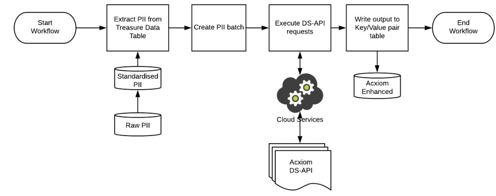
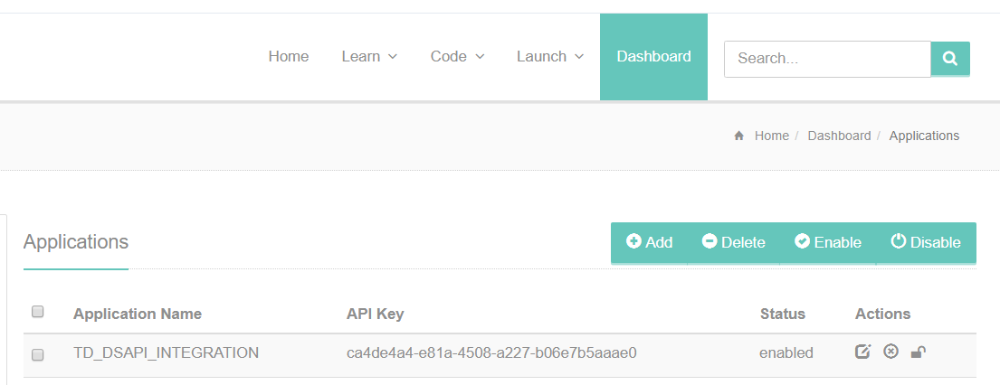
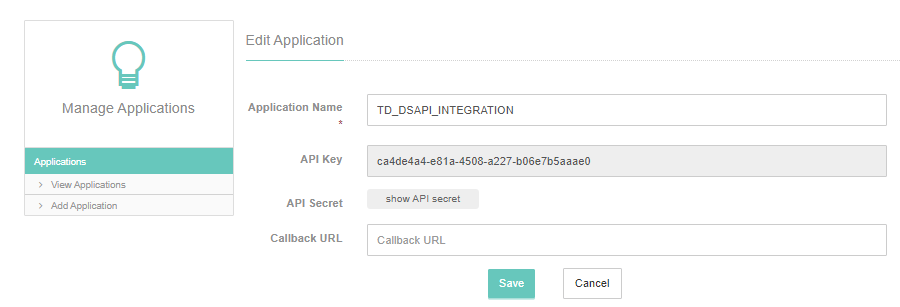
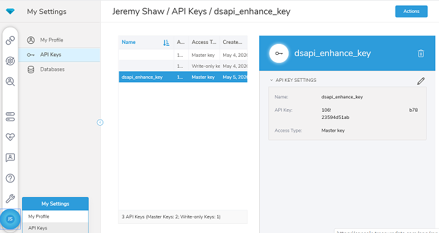
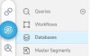
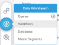
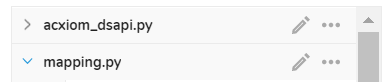
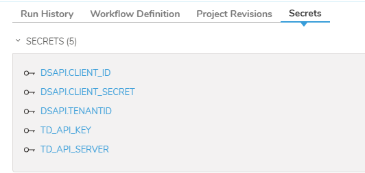

# Acxiom Data Services (DS-API) Integration

## Integration Overview

The Acxiom data services API (DS-API) provides a common interface to access Acxiom's core toolset including:

* Name and address standardisation and parsing to postal standards.
* Matching a consumer's PII to Acxiom's data and enriching.
* Advanced 1st party data identity resolution through Acxiom's Identity Builder™.

The following guide demonstrates the integration of a Treasure Data workflow with Acxiom's DS-API services. 
Note: The dataset used for this demonstration is entirely synthetic.



# Pre-requisites
1. Login access to Treasure Data console. [https://console.treasuredata.com/app](https://console.treasuredata.com/app)

2. A Login account on the Acxiom Developer DS-API console. Register here [https://developer.myacxiom.com](https://developer.myacxiom.com/)

3. Add an 'Application Name' in the DS-API Developer console to create an API Key (DSAPI.CLIENT_ID) and API Secret (DSAPI.CLIENT_SECRET)



4. A Treasure Data API key (TD_API_KEY) with Master Access and Server (TD_API_SERVER):



## Source data preparation

1. If required, create a new database via the TD console using the  menu option and pressing the   button.
2. Upload PII data to database using the Integration -> Sources screen. 
Click on  
The data must contain an identity field. Sample data has been provided in the file:
[US Style Synthetic Data](US_synthetic.csv)

   

## Add enrichment workflow

1. Add a workflow template and click the Workflows menu:


2. Under workflow definition, click on New workflow:


3. Next add in the Python scripts and paste the template code from GIT: 



4. Next add in the secrets:



Note: Leave DSAPI.TENANTID=empty for the US Synthetic data.

## Configuring the Enrichment Flow

### Set input mapping rules

The input PII mapping rules are stored in the python script mappings.py.

The script contains mapping rules specified for each DS-API request field. The rules are specified using SQL functions as you would use in a SQL selected statement.

For example:

**mapping.py**
```python
source_mapping = {
    'id': 'id',
    'firstName': 'firstname',
    'middleName': 'middlename',
    'lastName': 'lastname',
    'streetAddress': """Coalesce(
                  Coalesce(primarynumber, '')||
                  Coalesce(' ' || predirectional, '')||
                  Coalesce(' ' || street, '')||
                  Coalesce(' ' || streetsuffix, '')||
                  Coalesce(' ' || postdirectional, '')||
                  Coalesce(' ' || unitdesignator, '')||
                  Coalesce(' ' || secondarynumber, ''),
                '')""",
        'city': 'city',
        'state': 'state',
        'zipCode': 'truncate(zipcode)'
        }
```

The DS-API fields are documented in developer.myacxiom.com.

### Set the runtime parameters in the DigDag
```yaml
# Make sure Python Custom Scripting feature is enabled for your TD account.
# See also: https://support.treasuredata.com/hc/en-us/articles/360026713713-Introduction-to-Custom-Scripts
 
+task1:
  py>: acxiom_dsapi.bundle_append
  _env:
    DSAPI_OAUTH_ENDPOINT: 'https://api.acxiom.com/api/v1'
    DSAPI_OAUTH_METHOD: '/auth/oauth2/token'
    DSAPI_OAUTH_SCOPE: ''
    DSAPI_OAUTH_GRANT_TYPE: 'client_credentials'
    DSAPI_OAUTH_USERNAME: ''
    DSAPI_OAUTH_PASSWORD: ''
    DSAPI_CLIENT_ID: ${secret:DSAPI.CLIENT_ID}
    DSAPI_CLIENT_SECRET: ${secret:DSAPI.CLIENT_SECRET}
    DSAPI_TENANTID: ''
    DSAPI_ROLE: ''
    DSAPI_MATCH_ENDPOINT: 'https://test.api.acxiom.com/v1'
    # Availble match types are : entities, people, households, places, postcodes.
    # Multiple match types can be specified as a comma separated list e.g. '/person/match,/households/match'
    DSAPI_MATCH_METHOD: '/person/match'
    DSAPI_MATCH_OPTIONS: ''
    # 0 no debug information returned, >1 PII returned in log
    DSAPI_DEBUG_LEVEL: 0
    DATABASE_NAME: 'dsapi_synthetic'
    SOURCE_TABLE: 'raw_synth_pii'
    DEST_TABLE: 'dsapi_enhanced_demo'
     
    TD_API_KEY: ${secret:TD_API_KEY}
    TD_API_SERVER: ${secret:TD_API_SERVER}

  # bundles: ''  returns all available bundles.
  bundles: ''
  enginename: 'presto' 
  max_recs_to_process: 500
  api_batch_limit: 100
  docker:
     image: "digdag/digdag-python:3.7"
 ```

## Connectivity Testing

The following DigDag is provided to help test connectivity and credentials.
Add a new workflow using the blank template and paste in the digDag below (or from dsapi_smoketest.dig)
Add in the secrets for DSAPI.CLIENT_ID, DSAPI.CLIENT_SECRET and set DSAPI.TENANTID to empty.

```yaml
_export:
  credentials:
     oauth_endpoint: "https://api.acxiom.com/api/v1/auth/oauth2/token"
     client_id: ${secret:DSAPI.CLIENT_ID}
     client_secret: ${secret:DSAPI.CLIENT_SECRET}
     grant_type: "client_credentials"
  dsapi:
      endpoint: "https://test.api.acxiom.com/v1/people/match"
      bundle: ""
      tenant_id: ${secret:DSAPI.TENANTID}
      role: ""
      match_options: ""

  pii:
     rec1: "firstName=EMALYN&middleName=HARLOW&lastName=MAJOR&streetAddress=4740+CHATFORD+AVE&city=BALTIMORE&state=MD&zipCode=21206"

     
+get_oauth:
  echo>: Getting oAuth from ${pii.oauth_endpoint}
+post_request:
  http>: ${credentials.oauth_endpoint}
  method: POST
  content-format: form
  store_content: true
  content: 
    client_secret=${credentials.client_secret}&client_id=${credentials.client_id}&grant_type=${credentials.grant_type}
  headers:
    - Content-Type: application/x-www-form-urlencoded

+enrich:
  http>: ${dsapi.endpoint}?${pii.rec1}&bundle=${dsapi.bundle}&${dsapi.match_options}&role=${dsapi.role}&tenant=${dsapi.tenant_id}
  method: GET
  store_content: true
  headers:
    - Accept: application/json
    - Authorization: Bearer ${JSON.parse(http.last_content)["access_token"]}
    
+show_results:
  echo>: results ${http.last_content}

```


