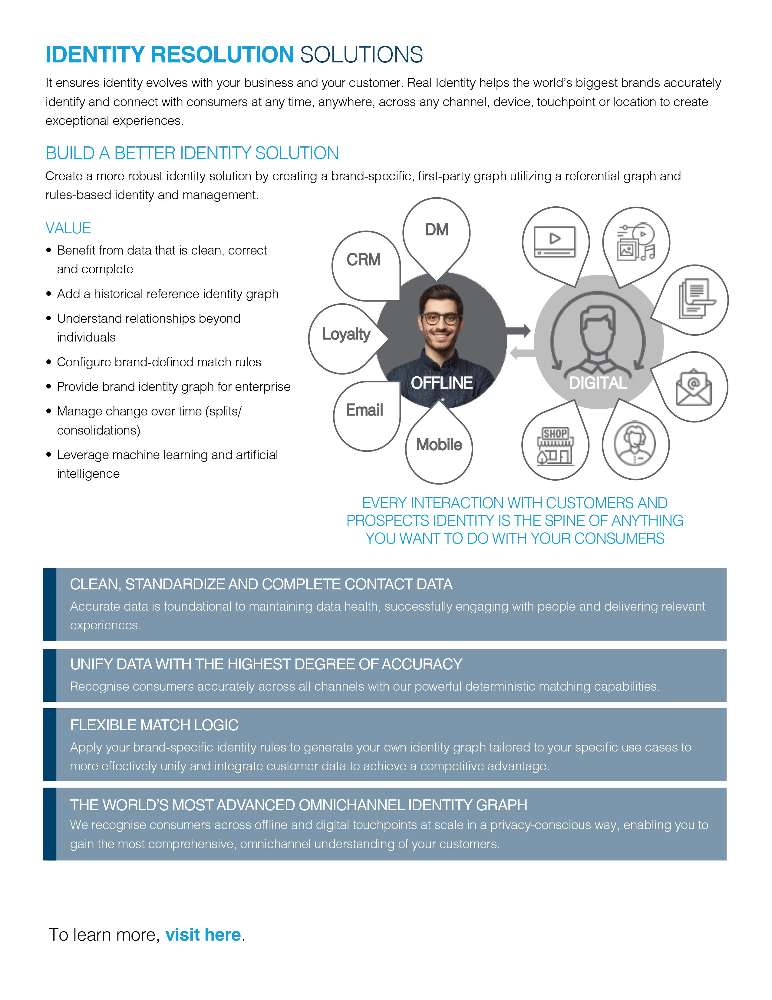
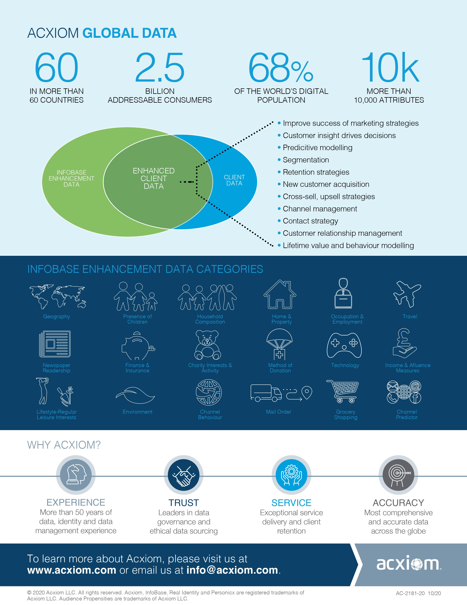

[](image.png)

# Treasure Data + Acxiom Integrations
These Treasure Boxes give you everything you need to integrate with Acxiom [realIdentity™][acxrealidentity] which offers flexible match logic and configurable identity rules to tailor a first-party identity graph to your unique brand requirements to drive more accurate engagement while supporting key use cases as third-party cookies become obsolete.

- Power Relevant Messaging
- Unify Customer Identity
- Achieve More Accurate Engagement
- Delivery Continuity in the Customer Journey
- Manage Enterprise Identity For Maximum Business Impact

This repository has shared code and blueprint implementations for the following integration patterns.

| Integration | Description |
| ----------- | ----------- |
| [Prepare and Unify Customer Profiles using Acxiom DS-API](#1-prepare-and-unify-customer-profiles-using-acxiom-ds-api) | Reads CDP Profile information in Treasure Data;<br/>Standardises and Unifies the data against a private identity graph;<br/>Writes the Identified and Standardized profile back to Treasure Data |
| [Sync rGraph360 digital profile with Treasure Data](#2-sync-rgraph360-digital-profile-with-treasure-data) | Reads first party cookie identifier from Treasure Data;<br/>Looks up the profile using the [realIdentity™][acxrealidentity] rAPID API and retrieves the current graph entry|
| [Bring rTag Owned and Paid Behavior data into Treasure Data​](#3-bring-rtag-owned-and-paid-behavior-data-into-treasure-data) | Reads the last X days worth of logs from the rAPID data repository;<br/>Writes the Owned and Paid Behavior data back to Treasure Data|
| [Enhance and Extend Customer Profiles using Acxiom DS-API​](#4-enhance-and-extend-customer-profiles-using-acxiom-ds-api) | Extracts CDP Profile information from Treasure Data;<br/>Matches to Acxiom Infobase;<br/>Brings a bundle of data back into Treasure Data to enrich the profile with Geodemographic data|
| [Demo of 2020 TreasureBox against US Synthetic Data​](Acxiom_TreasureBox) | 2020 Treasure Box included for reference, Includes developer instructions to set up a match of synthetic data to a demonstration API |

## Architecture
[](image.png)

## Tech
All integrations require python scripting to be enabled inside of your Treasure Data Account as they are designed to run as python workflows.  
See also: https://docs.treasuredata.com/display/public/PD/Custom+Scripts

The following commonly used libraries are used, these are all pre-installed in the Treasure Data Platform.
- requests
- logging
- urllib3
- time
- dotenv (used for local development)
- pathlib
- os
- hashlib
- pytd
- pandas


___
## Integrations
### 1. Prepare and Unify Customer Profiles using Acxiom DS-API
Sends first party data through Acxiom DS-API to be loaded to a first party known graph in real time.​  Receive back identification keys into Treasure Data.

Enhances Treasure Data Customer profiles with persistent Identifiers (realID) based on known customer data, used to link an identity in Treasure Data to a known or digital identity in rGraph360.

**Sample Use Cases​**
- As a brand I wish to build a first party reference graph to match my digital data to my known customers in my CDP.​
- As a brand I need to obtain a persistent id which can be used between my offline and online data and be able to connect to other data and identity spines.


**Components**
| Component | Location |Description |
| ----------- | ----------- |----------- |
| `acxiom.py` | [classes/acxiom.py](classes/acxiom.py) | Python Class for interfacing with Acxiom Services such as DSAPI and [realIdentity™][acxrealidentity] |
| `treasureData.py` | [classes/treasureData.py](classes/acxiom.py) | Python Class for interfacing with the Treasure Data API, used for reading data from Treasure Data and writing back the results |
| `td_to_acxiom_identity.py` | [td_to_acxiom_identity.py](td_to_acxiom_identity.py) | Workflow code for reading data from Treasure Data, running it against DSAPI and writing identity and standardised data back to Treasure Data.  This is a blueprint implementation built to demonstrate how the a solution works and should vary depending on specific data structures and configurations inside Treasure Data|

**Installation**
Create a treasure Data workflow as a simple python task.

Replace the contents of the .dig file with the following.

```
+task1:
  py>: td_to_acxiom_identity.run_flow
  _env:
    logLevel="DEBUG"
    dsapi_oauth_endpoint=${secret:DSAPI_OAUTH_ENDPOINT}
    dsapi_oauth_method="/oauth2/default/v1/token"
    dsapi_oauth_grant_type="client_credentials"
    dsapi_oauth_scope=""
    dsapi_oauth_username=""
    dsapi_oauth_password=""
    dsapi_client_id=${secret:DSAPI_CLIENT_ID}
    dsapi_client_secret=${secret:DSAPI_CLIENT_SECRET}
    dsapi_tenant=${secret:DSAPI_TENANT}
    dsapi_role=${secret:DSAPI_ROLE}
    dsapi_match_method="/entities/match"
    dsapi_endpoint=${secret:DSAPI_ENDPOINT}
    dsapi_match_options="&countryCode=GBR&inferGender=name&bestOfBreedHygiene=true&inferGender=name"
    dsapi_match_bundles="clientIdentityGraph,inputGlobalAddress,inputEmailAddress,inputPhoneNumber,nameStandardization,inputName"
    dsapi_batchsize=100
    td_api_key=${secret:TD_API_KEY}
    td_api_server=${secret:TD_API_SERVER}
    td_engine_name="presto"
  arg1: 123
  docker:
    image: "digdag/digdag-python:3.9"
```
only DSAPI variables are required as there is no direct connection to the realtime digital graph or repository in this blueprint.

**Configuration**

All configuration takes place by altering [environment variables][tdparameters] and [secrets][tdsecrets].

The following [secrets][tdsecrets] will contain values provided by Acxiom for the implementation.
- DSAPI_OAUTH_ENDPOINT
- DSAPI_ENDPOINT
- DSAPI_CLIENT_ID
- DSAPI_CLIENT_SECRET
- DSAPI_TENANT
- DSAPI_ROLE

These values will be available from the brands Treasure Data account.
- TD_API_KEY
- TD_API_SERVER

----

### 2. Sync rGraph360 digital profile with Treasure Data
Using a matched realID, email, ip address or cookie, interrogate the rGraph360 digital profile and enable data stored there to be used in Treasure Data.  Also allows data and insights that have been created in Treasure Data to be loaded onto the digital profile for use in real-time applications such as an Ad-tech bid.

**Datapoints​**
rGraph360 digital Identity attributes : The unified graph entry for a particular matched realID customer or a digital first party cookie / hashed email / ip address.  ​

Examples of attributes include
- Foreign keys to external Data or Identity spines
- The Treasure Data id generated by the treasure data javascript library (tdid)
- Segments and Interaction history stored against the graph itself that can be used to power realtime decisions.

**Sample Use Cases​**
- As a brand I wish to use the digital profile information stored in rGraph360 inside Treasure Data to do analytics.
- As a brand I wish to bring additional identity information such as a third party identifier that is stored in rGraph360 into Treasure Data.
- As a brand I want to use the digital profile information stored on a single customer in rGraph360 to power a marketing decision.


**Components**
| Component | Location |Description |
| ----------- | ----------- |----------- |
| `acxiom.py` | [classes/acxiom.py](classes/acxiom.py)| Python Class for interfacing with Acxiom Services such as DSAPI and [realIdentity™][acxrealidentity] |
| `treasureData.py` | [classes/treasureData.py](classes/acxiom.py) | Python Class for interfacing with the Treasure Data API, used for reading data from Treasure Data and writing back the results |
| `td_to_acxiom_digital_graph.py` | [td_to_acxiom_digital_graph.py](td_to_acxiom_digital_graph.py) | Workflow code for reading data from Treasure Data, gathering a list of first party identifiers (cookie ids) and pulling back the current data on the graph into Treasure Data, writing it to a table.  This is a blueprint implementation built to demonstrate how the a solution works and should vary depending on specific data structures and configurations inside Treasure Data and the digital graph|

**Installation**
Create a treasure Data workflow as a simple python task.

Replace the contents of the .dig file with the following.

```
+task1:
  py>: td_to_acxiom_digital_graph.run_flow
  _env:
    logLevel="DEBUG"
    realId_baseUrl=${secret:REALID_CLIENT_ENDPOINT}
    realId_clientId=${secret:REALID_CLIENT_ID}
    realId_oauthEndpoint=${secret:REALID_OAUTH_ENDPOINT}
    realId_oauthMethod="/v1/access_token"
    realId_oauthGrantType="access_token"
    realId_oathRefreshToken=${secret:OAUTH_REFRESH_TOKEN}
    realId_domain=${secret:REALID_CLIENT_DOMAIN}
    td_api_key=${secret:TD_API_KEY}
    td_api_server=${secret:TD_API_SERVER}
    td_engine_name="presto"    
  arg1: 123
  docker:
    image: "digdag/digdag-python:3.9"
```

Only [realIdentity™][acxrealidentity] variables are required as there is no direct connection to Acxiom DSAPI (Data Services API) in this blueprint.

**Configuration**

All configuration takes place by altering [environment variables][tdparameters] and [secrets][tdsecrets].

The following [secrets][tdsecrets] will contain values provided by Acxiom for the implementation.
- REALID_CLIENT_ENDPOINT
- REALID_CLIENT_ID
- REALID_OAUTH_ENDPOINT
- OAUTH_REFRESH_TOKEN
- REALID_CLIENT_DOMAIN

These values will be available from the brands Treasure Data account.
- TD_API_KEY
- TD_API_SERVER

----

### 3. Bring rTag Owned and Paid Behavior data into Treasure Data​
Using a preset named query, pull back the last X days worth of rTag exposure logs and load them to a table inside Treasure Data.

**Datapoints​**

rGraph360 Profile​
The unified graph entry for a particular matched realID customer or a digital first party cookie / hashed email / ip address.  ​
​
Examples of datapoints include, foreign keys to other identity or data spines.  Shared realtime profile attributes and models or interaction histories.

**Sample Use Cases​**

- As a brand I wish to use the digital profile information stored in rGraph360 inside Treasure Data to do analytics.
- As a brand I wish to bring additional identity information such as a third party identifier that is stored in rGraph360 into Treasure Data.
- As a brand I want to use the digital profile information stored on a single customer in rGraph360 to power a marketing decision.


**Components**
| Component | Location |Description |
| ----------- | ----------- |----------- |
| `acxiom.py` | [classes/acxiom.py](classes/acxiom.py)| Python Class for interfacing with Acxiom Services such as DSAPI and [realIdentity™][acxrealidentity] |
| `treasureData.py` | [classes/treasureData.py](classes/acxiom.py) | Python Class for interfacing with the Treasure Data API, used for reading data from Treasure Data and writing back the results |
| `td_to_acxiom_rTag_interactions.py` | [td_to_acxiom_rTag_interactions.py](td_to_acxiom_rTag_interactions.py) | Workflow code for reading data from the Acxiom rAPID data repository, gathering the last X days of paid and owned media interactions and writing it to a table.  This is a blueprint implementation built to demonstrate how the a solution works and should vary depending on specific data structures and configurations inside Treasure Data and the rAPID data repository|

**Installation**
Create a treasure Data workflow as a simple python task.

Replace the contents of the .dig file with the following.

```
+task1:
  py>: td_to_acxiom_rTag_interactions.run_flow
  _env:
    logLevel="DEBUG"
    realId_baseUrl=${secret:REALID_CLIENT_ENDPOINT}
    realId_clientId=${secret:REALID_CLIENT_ID}
    realId_oauthEndpoint=${secret:REALID_OAUTH_ENDPOINT}
    realId_oauthMethod="/v1/access_token"
    realId_oauthGrantType="access_token"
    realId_oathRefreshToken=${secret:OAUTH_REFRESH_TOKEN}
    realId_domain=${secret:REALID_CLIENT_DOMAIN}
    td_api_key=${secret:TD_API_KEY}
    td_api_server=${secret:TD_API_SERVER}
    td_engine_name="presto"    
  arg1: 123
  docker:
    image: "digdag/digdag-python:3.9"
```
Only [realIdentity™][acxrealidentity] variables are required as there is no direct connection to Acxiom DSAPI (Data Services API) in this blueprint.

**Configuration**

All configuration takes place by altering [environment variables][tdparameters] and [secrets][tdsecrets].

The following [secrets][tdsecrets] will contain values provided by Acxiom for the implementation.
- REALID_CLIENT_ENDPOINT
- REALID_CLIENT_ID
- REALID_OAUTH_ENDPOINT
- OAUTH_REFRESH_TOKEN
- REALID_CLIENT_DOMAIN

These values will be available from the brands Treasure Data account.
- TD_API_KEY
- TD_API_SERVER

----

### 4. Enhance and Extend Customer Profiles using Acxiom DS-API​
Sends first party data through Acxiom DS-API to be matched against Acxioms infobase reference graph.

Enhances Treasure Data Customer profiles with Geo-demographic data from Acxiom's [INFOBASE][infobase] product.

**Sample Use Cases​**
- As a brand I need to enrich my customer data with 3rd party data to drive insights and help me understand my customers.
- As a brand I want to improve my segmentation by enriching my CDP customer profiles with Acxiom Infobase variables.

**Components**
| Component | Location |Description |
| ----------- | ----------- |----------- |
| `acxiom.py` | [classes/acxiom.py](classes/acxiom.py) | Python Class for interfacing with Acxiom Services such as DSAPI and [realIdentity™][acxrealidentity] |
| `treasureData.py` | [classes/treasureData.py](classes/acxiom.py) | Python Class for interfacing with the Treasure Data API, used for reading data from Treasure Data and writing back the results |
| `td_to_acxiom_data_enhancement.py` | [td_to_acxiom_data_enhancement.py](td_to_acxiom_data_enhancement.py) | Workflow code for reading data from Treasure Data, running it against DSAPI and writing matched geodemographic attreibutes back to Treasure Data.  This is a blueprint implementation built to demonstrate how the a solution works and should vary depending on specific data structures and configurations inside Treasure Data|

**Installation**
Create a treasure Data workflow as a simple python task.

Replace the contents of the .dig file with the following.

```
+task1:
  py>: td_to_acxiom_identity.run_flow
  _env:
    logLevel="DEBUG"
    dsapi_oauth_endpoint=${secret:DSAPI_OAUTH_ENDPOINT}
    dsapi_oauth_method="/oauth2/default/v1/token"
    dsapi_oauth_grant_type="client_credentials"
    dsapi_oauth_scope=""
    dsapi_oauth_username=""
    dsapi_oauth_password=""
    dsapi_client_id=${secret:DSAPI_CLIENT_ID}
    dsapi_client_secret=${secret:DSAPI_CLIENT_SECRET}
    dsapi_tenant=${secret:DSAPI_TENANT}
    dsapi_role=${secret:DSAPI_ROLE}
    dsapi_enhance_method="/place/match"
    dsapi_endpoint=${secret:DSAPI_ENDPOINT}
    dsapi_enhance_options="&countryCode=GBR&inferGender=name&bestOfBreedHygiene=true&inferGender=name"
    dsapi_enhance_bundles="clientIdentityGraph,inputGlobalAddress,inputEmailAddress,inputPhoneNumber,nameStandardization,inputName"
    dsapi_batchsize=100
    td_api_key=${secret:TD_API_KEY}
    td_api_server=${secret:TD_API_SERVER}
    td_engine_name="presto"    
  arg1: 123
  docker:
    image: "digdag/digdag-python:3.9"
```
only DSAPI variables are required as there is no direct connection to the realtime digital graph or repository in this blueprint.

**Configuration**

All configuration takes place by altering [environment variables][tdparameters] and [secrets][tdsecrets].

The following [secrets][tdsecrets] will contain values provided by Acxiom for the implementation.
- DSAPI_OAUTH_ENDPOINT
- DSAPI_ENDPOINT
- DSAPI_CLIENT_ID
- DSAPI_CLIENT_SECRET
- DSAPI_TENANT
- DSAPI_ROLE

These values will be avbailable from the brands Treasure Data account.
- TD_API_KEY
- TD_API_SERVER

## Further Information




[](https://www.acxiom.co.uk/resources/acxiom-and-treasure-data-better-together/)

Acxiom Website [www.acxiom.com](https://www.acxiom.com)

Treasure Data Website [www.treasuredata.com](https://www.treasuredata.com/)

Acxiom Global Data Navigator [Global Data Navigator](https://marketing.acxiom.com/ACX-GlobalDataNavigator.html?&utm_source=website&utm_medium=owned&utm_campaign=gdn-tool)

[tdsecrets]: https://docs.treasuredata.com/display/public/PD/Setting+Workflow+Secrets+from+TD+Console
[tdparameters]: https://docs.treasuredata.com/display/public/PD/Passing+Parameters+to+Custom+Scripts+used+in+TD+Workflow
[acxrealidentity]: https://www.acxiom.com/identity-resolution-solutions/
[infobase]: https://www.acxiom.com/customer-data/infobase/
